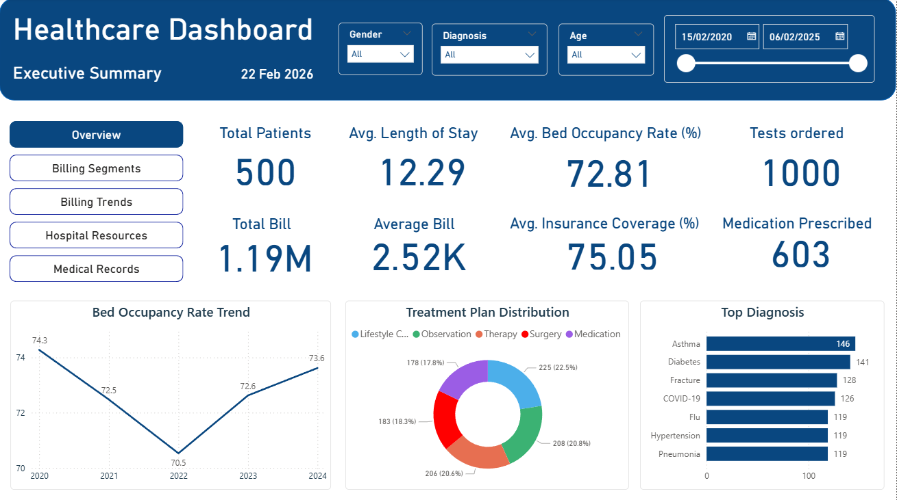

# Healthcare Analytics Dashboard - Power BI Project

🔗 **Dataset Source:**  
Healthcare Datasets Sample (Kaggle)  
https://www.kaggle.com/datasets/benitoitelewuver/healthcare-datasets-sample

---

## Project Overview

This repository contains a **Power BI report (.pbix)** developed using a synthetic healthcare dataset.  

The dashboard provides interactive insights into:

- Patient demographics
- Admission trends
- Medical conditions
- Billing and insurance analysis
- Clinical test results

The goal of this project is to demonstrate data modeling, DAX calculations, and interactive visualization skills using Power BI.

---

## Dataset Description

The dataset is a synthetic healthcare dataset designed for data analysis and visualization practice. It simulates real-world hospital records while maintaining privacy.

### Key Attributes

| Column | Description |
|--------|-------------|
| Name | Patient name |
| Age | Age of patient |
| Gender | Patient gender |
| Blood Type | Blood group (e.g., A+, O-) |
| Medical Condition | Primary diagnosis |
| Date of Admission | Admission date |
| Doctor | Attending physician |
| Hospital | Facility name |
| Insurance Provider | Payer name |
| Billing Amount | Total healthcare charges |
| Room Number | Assigned room |
| Admission Type | Emergency, Elective, etc. |
| Discharge Date | Date of discharge |
| Medication | Prescribed medication |
| Test Results | Normal / Abnormal / Inconclusive |

---

## Dashboard Features

### 1. Patient Demographics
- Age distribution
- Gender breakdown
- Blood type analysis

### 2. Admission Insights
- Admissions by type
- Monthly/Yearly admission trends
- Length of stay analysis

### 3. Medical Analysis
- Most common conditions
- Medication usage patterns
- Test result distribution

### 4. Financial Overview
- Total billing amount
- Average billing per patient
- Insurance provider comparison

---

## Tools & Technologies

- Microsoft Power BI Desktop
- DAX (Data Analysis Expressions)
- Data modeling
- Interactive visualizations

---

## Dashboard Preview

---

## How to Use

1. Download or clone this repository.
2. Open the `.pbix` file using Microsoft Power BI Desktop.
3. If prompted, update the data source path to match your local dataset location.
4. Refresh the dataset (Home → Refresh) to load the data.
5. Use slicers, filters, and interactive visuals to explore insights.

---

## License

This project is licensed under the **Apache License 2.0**.

You are free to:
- Use
- Modify
- Distribute
- Use commercially

Under the following conditions:
- You must include a copy of the license.
- You must provide proper attribution.
- You must state significant changes made to the original work.

See the `LICENSE` file in this repository for full details.

---

## Acknowledgements

- Dataset sourced from Kaggle:  
  *Healthcare Datasets Sample* by benitoitelewuver  
  https://www.kaggle.com/datasets/benitoitelewuver/healthcare-datasets-sample

- Built using Microsoft Power BI Desktop.

---

## Questions

If you have any questions, suggestions, or feedback:

- Open an issue in this repository.
- Fork the project and submit a pull request.
- Reach out via GitHub profile.

Contributions and improvements are welcome.
